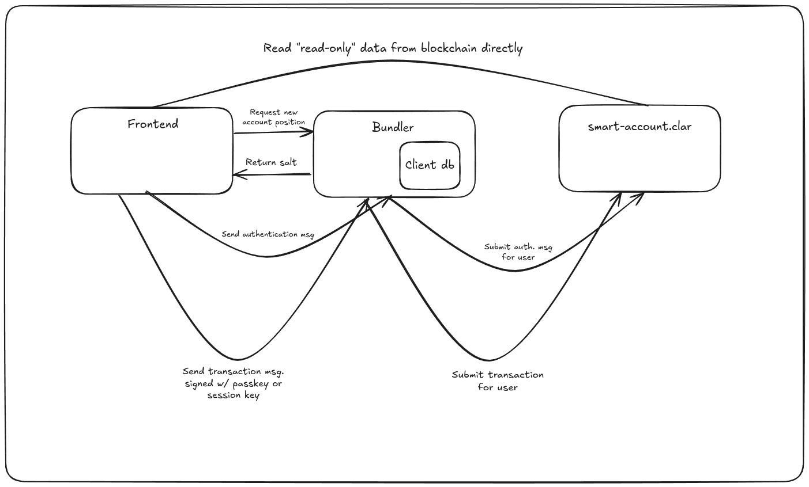

# btc-smart-accounts

A simplified version of ERC4337.

## Goals

A smart contract managed with a third-party provider
A smart contract managed with MetaMask Wallet

## Technical



### Authentication

Currently there is 1 authentication flow that is fully implemented with more planned including:
- [X] Derive a private key from a passkey credential
- [ ] Native passkey verification on-chain using P-256 verifier, see `contracts/contracts/auth/passkeysv2.clar`
- [ ] Verify email authentication permissionlessly, see [here](https://docs.zk.email/architecture/on-chain)
- [ ] Verify identity using your password, see [here](https://docs.self.xyz/technical-docs/architecture)
- [ ] Verify identity using Aadhaar ID, see [here](https://documentation.anon-aadhaar.pse.dev/docs/proof)

## Directory structure

- bundler
  - The bundler submits the transactions on behalf of the user
  - Extra features: pregenerate wallets,
- contracts
  - Contain the smart contracts, including: `smart-account.clar`, `smart-account-factory.clar`, `safe.clar`, `authenticate.clar` and `256-lib/*.clar`
  - [WIP] A contarct to verify `secp256r1` signatures on-chain
- frontend
  - An interface to manage your accounts
- sdk
  - An sdk to implement the authentication and transactions

## How to run

In 3 different terminals run the following commands:

``` bash
# 1
cd frontend
yarn
yarn run dev

# 2
cd bundler
./start-database.sh
yarn
yarn db:generate
yarn run dev

# 3, this might take longer
cd contracts
yarn
yarn run dev
```

<!-- TODO
  1. Implement passkeys encryption/decryption and use secp256k1 to validate signature
  2. Minimal account abstraction, maybe a simple NFT transfer example
  3. Auth provider on the frontend: https://chatgpt.com/c/67d345c2-1424-8004-8f3c-d6f5cd2843de, https://react.dev/reference/react/useContext
  4. Modal for authentication
  5. Session for each sub-account
  6. EOA w/ social recovery
  7. Record video
  8. (BONUS) Verify passkey on-chain
 -->
