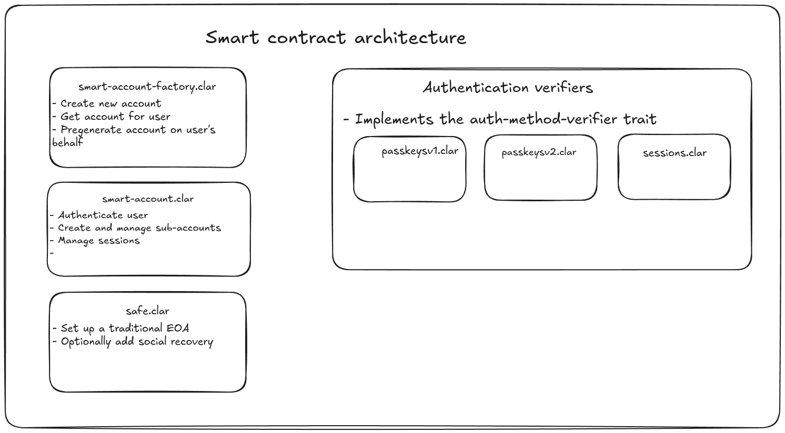

# Contracts

## Architecture

## Authentication workflows

| Workflow      | Status            |
| ------------- | ----------------- | 
| Passkeys (v1) | ✅ Ready          | 
| Passkeys (v2) | 🚧 In-development |
| Session keys  | 🚧 In-development |
| Email         | ❌ Planned        |
| Passport      | ❌ Planned        |
| Aadhaar ID    | ❌ Planned        |

### Passkeys v1

This is a hybrid approach where the bundler holds each user's salt from which a user can generate their private key with passkeys. The transaction are signed over the secp256k1 curve which the smart contract can natively verify.  
This approach is safe since only the passkey holder can sign any transaction, only limitation being if the bundler is compromised and the salt is lost, although this can be easily mitigated by storing the salt in a cold wallet or a piece of paper.

### Passkeys v2

Passkeys sign data over the secp256r1 curve and to verify on-chain we need to implement it in Clarity.

The current progress:

- [x] 256-bit integer library (`contracts/uint256-lib/uint256-lib.clar`)
- [ ] Elliptic Curve library (`contracts/uint256-lib/ecc-lib.clar`)
- [ ] P-256 signature verification library (`contracts/auth/passkeysv2.clar`)

### Session keys

Session keys sign transaction over the secp256k1 curve. Each session key is linked to a sub account and a nonce has to be signed to protect against replay attacks.

### DIDs

To name a few:

- ZKEmail
- OpenPassport
- Anon Aadhaar

Verify zk signatures on-chain signed with DKIM, government issued e-passport, Aadhaar ID, etc..  
These are public goods created by PSE team.
